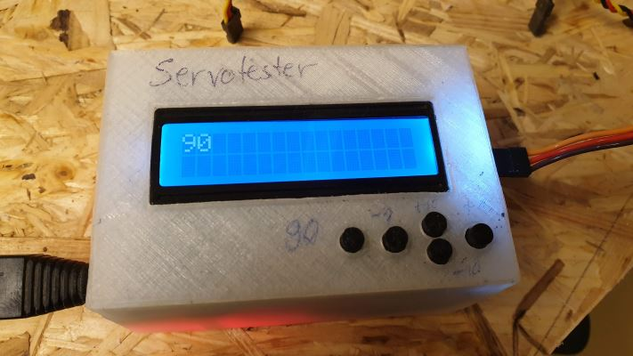
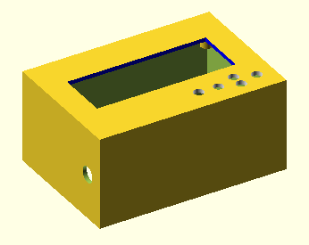
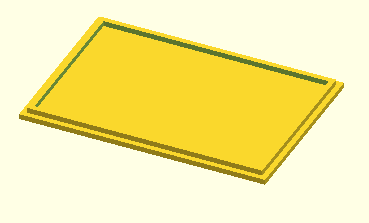
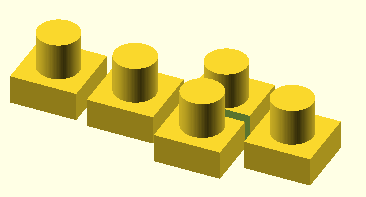
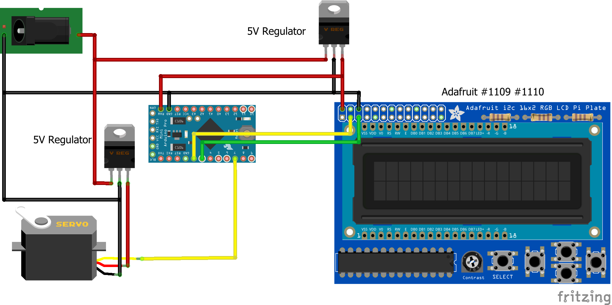
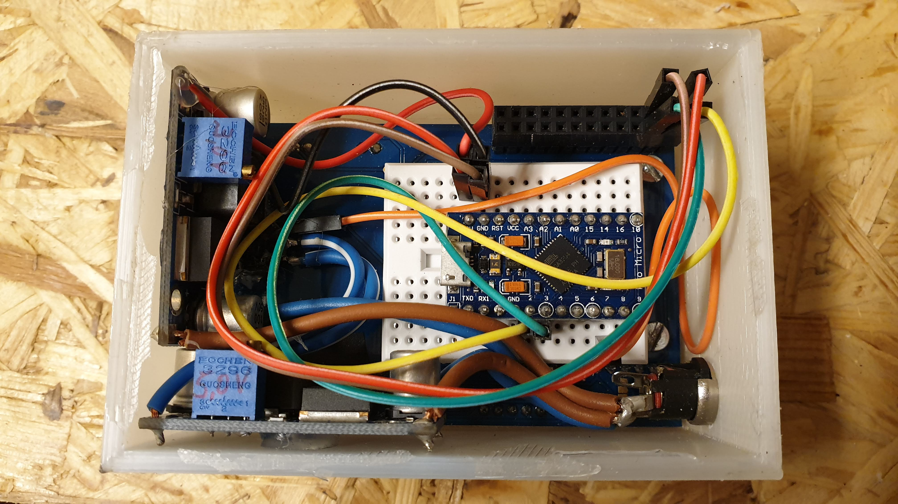

# servotester

This is an Arduino based testing and calibration device for servo motors.

I use it for testing the maximum usable angles of the motors in my [InMoov](https://inmoov.fr/) robot.

## Parts to buy

- Arduino Pro Micro 5V - [Amazon ~9€](https://www.amazon.de/Micro-ATmega32U4-Arduino-Leonardo-%C3%A4hnlich/dp/B01D0OI90U/ref=sr_1_3?__mk_de_DE=%C3%85M%C3%85%C5%BD%C3%95%C3%91&keywords=arduino+pro+micro&qid=1573421766&sr=8-3)
- Adafruit 16x2 LCD Kit - [Amazon ~22€](https://www.amazon.de/Adafruit-Positive-LCD-mit-Raspberry-Computer/dp/B00N973FZI/ref=sr_1_4?__mk_de_DE=%C3%85M%C3%85%C5%BD%C3%95%C3%91&keywords=adafruit+lcd&qid=1573421897&sr=8-4)
- PIN Headers - the ones from the arduino can be used
- DC-DC Step Down Converter - [Amazon 6pcs ~10€](https://www.amazon.de/QLOUNI-LM2596-Converter-0-40V-Stromversorgung/dp/B077VW4BTY/ref=sr_1_3?__mk_de_DE=%C3%85M%C3%85%C5%BD%C3%95%C3%91&keywords=voltage+regulator&qid=1573422022&sr=8-3)
- DC Jacks - [Something like this](https://www.amazon.de/St%C3%BCck-Mount-Buchse-Anschluss-Sockel/dp/B00H8WFGAM/ref=pd_sim_23_7?_encoding=UTF8&pd_rd_i=B00H8WFGAM&pd_rd_r=60d3c61f-e75c-40bd-b5ed-f9e23ebbbcd6&pd_rd_w=OybRN&pd_rd_wg=SeI1k&pf_rd_p=aa6868bc-7f33-4250-a93e-814f2dbbfd97&pf_rd_r=XT15DPPZE7E49ZWY024Z&psc=1&refRID=XT15DPPZE7E49ZWY024Z)
- Power source (laboratory power supply or USB power bank)
- Some cables

As power source I use a laboratory power supply but anything with more than 6V should work (you need so much because of the voltage regulators). The regulators split up the power lines so that the servo does not affect the arduino when rotating (and so using much power).

## Parts to print

You do not need to print any parts. The 3D printed parts are only for the surrounding case. The device itself also works without the case but does not look so good without it.

You can find all printable parts [here at Thingiverse](https://www.thingiverse.com/thing:3968126) containing SCAD sources if you want to tune them for yourself. What you need is:

|Part|Image|
|---|---|
|[Top case](print/Oberteil.stl)||
|[Bottom case](print/Unterteil.stl)||
|[Button extenders](print/Cross.stl)||

I personally leave the bottom open so that I can access the electronics easily and to save plastic waste.

## Programming

As processing unit I used an arduino, not a raspberry, what the LCD plate was build for. You can find the program in [servotester.ino](arduino/servotester/servotester.ino).

You will need the download version of the [Arduino IDE](https://www.arduino.cc/en/main/software) to write the program to the arduino.

So download the [servotester.ino](arduino/servotester/servotester.ino) file, flash it to the arduino and put it in the case.

## Assembling

[Here](fritzing/servotester.fzz) is a [Fritzing](https://fritzing.org/home/) schema file I used to draw the image below.

Wire the parts as shown here.

|Arduino pin|LCD panel pin|Servo motor wire color|
|---|---|---|
|D2|SDA||
|D3|SCL||
|D7||yellow|

## Usage

1. Power on the device and wait until the display shows a "90". This is the initial servo position when starting.
2. Plug in the servo motor.
3. Now you can use the buttons to steer the motor.

|Button|Meaning|
|---|---|
|First from left|Set the angle to 90 degrees (center)|
|Second from left|Decrease the angle by 1 degree|
|First from right|Increase the angle by 1 degree|
|Top second from right|Increase the angle by 10 degrees|
|Bottom second from right|Decrease the angle by 10 degrees|

If you are not sure whether 90 degrees can be reached by your servo, set a safe angle **before** you connect the motor.

Have fun!
